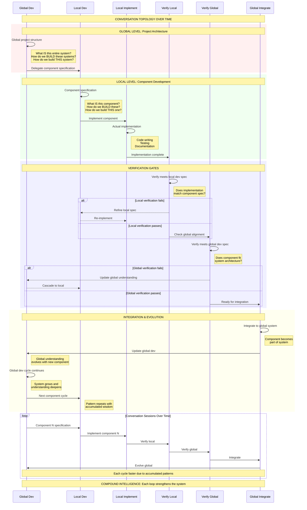

# Biphasic Conversation Topology: Global/Local Levels

## The Core Pattern: Every Conversation is Dev→Implement



## The Biphasic Pattern at Each Level:

### Global Level Biphasic Loop:
```
Global Dev → Global Implementation (via Local cycles) → Global Dev (evolved)
```

### Local Level Biphasic Loop:
```
Local Dev → Local Implementation → Local Dev (refined)
```

### The Complete Topology:
```
Global Dev
    ↓
Local Dev
    ↓
Local Implement
    ↓
Verify Local Spec
    ↓
Verify Global Spec
    ↓
Integrate to Global
    ↓
Global Dev (evolved)
    ↓
[Loop continues with next component]
```

## Key Insights:

1. **Biphasic Core**: Every conversation alternates between DEV and IMPLEMENT phases

2. **Two Levels**: 
   - **Global**: System-wide architecture and understanding
   - **Local**: Component-specific development

3. **Verification Gates**:
   - **Local Verification**: Does implementation match component spec?
   - **Global Verification**: Does component fit system architecture?

4. **Evolution Pattern**:
   - Each local cycle informs global understanding
   - Global evolution guides future local cycles
   - Compound intelligence emerges from this feedback

5. **Conversation Topology**:
   - Not linear but cyclical with feedback
   - Global and local levels interact continuously
   - Verification ensures coherence
   - Integration evolves the system

## The Universal Truth:

**Every conversation in the project follows this biphasic topology:**
- Start with dev (understanding/specifying)
- Move to implement (building/testing)
- Verify alignment (local then global)
- Integrate and evolve
- Loop continues at higher level

This is how compound intelligence emerges - through repeated biphasic cycles at multiple levels with verification and integration feedback!