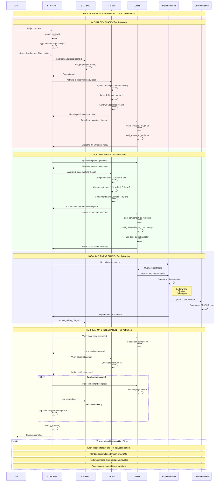

# Tool Activation Sequence: Operating the Biphasic Loop

## How We Actually Execute the Core Biphasic Pattern Using Our Tools

## Tool Responsibilities in the Biphasic Loop:

### **STARSHIP** - Orchestration
- `launch_routine()` - Start sessions
- `fly()` - Present flight configs (workflows)
- Route between phases
- `landing_routine()` - End sessions

### **STARLOG** - Context Management
- `init_project()` - New projects
- `orient()` - Load context
- `update_debug_diary()` - Capture discoveries
- Maintain continuity across sessions

### **3-Pass** - Systematic Thinking
- Global level: Project ontology
- Local level: Component design
- Verification: Architecture alignment
- Output: Specifications

### **GIINT** - Project Structure
- `create_project()` - Initialize structure
- `add_*()` functions - Build hierarchy
- Task management
- Progress tracking

### **Implementation** - Building
- Execute GIINT tasks
- Write actual code
- Run tests
- Debug issues

### **Documentation** - Knowledge Capture
- Code documentation
- README files
- API docs
- Pattern documentation

## The Key Insight:

The **biphasic loop** (from diagram 01) is the WHAT - the fundamental pattern.

This **tool activation sequence** is the HOW - how we operate that pattern using our tool ecosystem.

Together they show:
1. **The Pattern**: Global/Local Dev → Implement cycles with verification
2. **The Execution**: Which tools activate when to execute the pattern