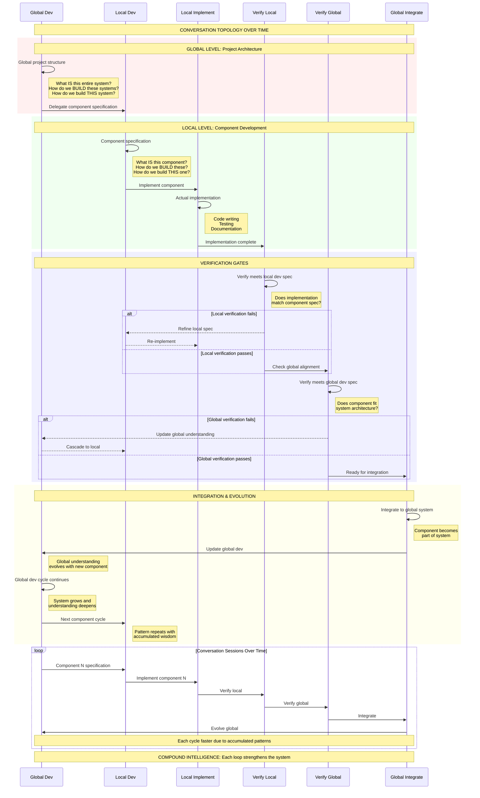
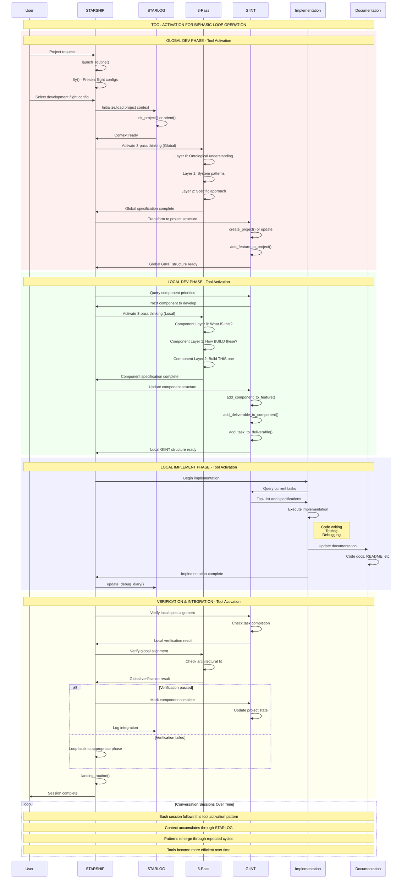
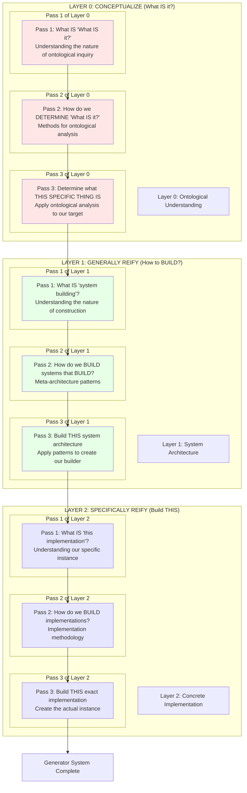
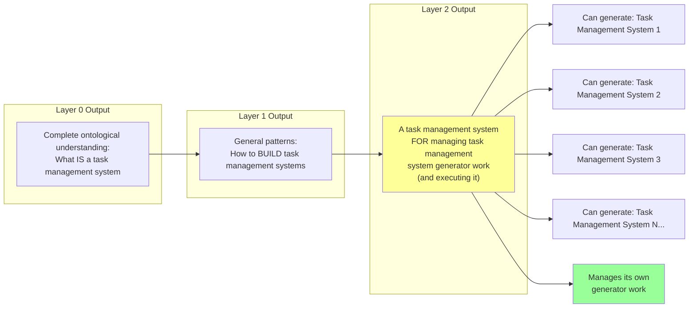

# Complete Compound Intelligence System Topology

This file contains the complete topology map for navigating the compound intelligence system. Read this to understand where you are in the overall flow and which tools to use next.

---

# Biphasic Conversation Topology: Global/Local Levels

## The Core Pattern: Every Conversation is Dev→Implement



## The Biphasic Pattern at Each Level:

### Global Level Biphasic Loop:
```
Global Dev → Global Implementation (via Local cycles) → Global Dev (evolved)
```

### Local Level Biphasic Loop:
```
Local Dev → Local Implementation → Local Dev (refined)
```

### The Complete Topology:
```
Global Dev
    ↓
Local Dev
    ↓
Local Implement
    ↓
Verify Local Spec
    ↓
Verify Global Spec
    ↓
Integrate to Global
    ↓
Global Dev (evolved)
    ↓
[Loop continues with next component]
```

---

# Tool Activation Sequence: Operating the Biphasic Loop

## How We Actually Execute the Core Biphasic Pattern Using Our Tools



## Tool Responsibilities in the Biphasic Loop:

### **STARSHIP** - Orchestration
- `launch_routine()` - Start sessions
- `fly()` - Present flight configs (workflows)
- Route between phases
- `landing_routine()` - End sessions

### **STARLOG** - Context Management
- `init_project()` - New projects
- `orient()` - Load context
- `update_debug_diary()` - Capture discoveries
- Maintain continuity across sessions

### **3-Pass** - Systematic Thinking
- Global level: Project ontology
- Local level: Component design
- Verification: Architecture alignment
- Output: Specifications

### **GIINT** - Project Structure
- `create_project()` - Initialize structure
- `add_*()` functions - Build hierarchy
- Task management
- Progress tracking

### **Implementation** - Building
- Execute GIINT tasks
- Write actual code
- Run tests
- Debug issues

### **Documentation** - Knowledge Capture
- Code documentation
- README files
- API docs
- Pattern documentation

---

# Traditional 3-Pass System: The Full 9-Pass Nested Structure

## The Complete 3-Layer System (9 Total Passes)



## The Crucial Mechanic: Layer 2 Creates a Generator

### Example: Task Management System



## The Pattern Explained:

When you complete all 9 passes for any domain:

**Layer 0** produces:
- Complete ontological understanding of the domain
- What IS [domain concept]?

**Layer 1** produces:
- General patterns for building systems in this domain
- How do we BUILD [domain] systems?

**Layer 2** produces:
- A [domain] system FOR managing [domain] system generator work
- It's opinionated to the Layer 1 scope
- It can generate other [domain] systems
- It manages the work of generating those systems

## The Key Insight:

The output of Layer 2 is **not just an instance** but a **generator that creates instances**.

Furthermore, this generator:
- Is itself an instance of what it generates
- Manages the work of generating other instances
- Is opinionated to the architectural patterns from Layer 1

---

# Complete System Integration

The three topology views work together:

1. **Biphasic Topology**: The fundamental pattern all conversations follow
2. **Tool Activation**: How to execute the pattern using our tool ecosystem  
3. **9-Pass System**: The systematic thinking method that creates generators

Together they provide the navigation map for compound intelligence system operation.