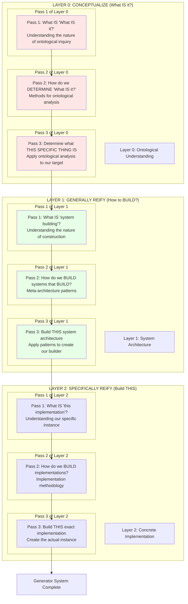
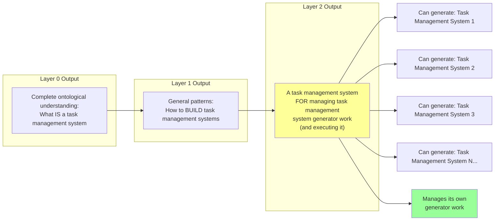

# Traditional 3-Pass System: The Full 9-Pass Nested Structure

## The Complete 3-Layer System (9 Total Passes)

## The Crucial Mechanic: Layer 2 Creates a Generator

### Example: Task Management System

## The Pattern Explained:

When you complete all 9 passes for any domain:

**Layer 0** produces:
- Complete ontological understanding of the domain
- What IS [domain concept]?

**Layer 1** produces:
- General patterns for building systems in this domain
- How do we BUILD [domain] systems?

**Layer 2** produces:
- A [domain] system FOR managing [domain] system generator work
- It's opinionated to the Layer 1 scope
- It can generate other [domain] systems
- It manages the work of generating those systems

## The Key Insight:

The output of Layer 2 is **not just an instance** but a **generator that creates instances**.

Furthermore, this generator:
- Is itself an instance of what it generates
- Manages the work of generating other instances
- Is opinionated to the architectural patterns from Layer 1

## Examples of the Pattern:

### Task Management System:
- **L0**: What IS task management?
- **L1**: How to BUILD task management systems
- **L2**: A task management system FOR managing task management system generator work

### Documentation System:
- **L0**: What IS documentation?
- **L1**: How to BUILD documentation systems
- **L2**: A documentation system FOR documenting documentation system generator work

### Testing Framework:
- **L0**: What IS testing?
- **L1**: How to BUILD testing frameworks
- **L2**: A testing framework FOR testing testing framework generator work

## The 9-Pass Matrix View:

| Layer | Pass 1 (Conceptualize) | Pass 2 (Generally Reify) | Pass 3 (Specifically Reify) |
|-------|------------------------|--------------------------|------------------------------|
| **Layer 0: CONCEPTUALIZE** (What IS?) | What IS "What IS it?" *Understanding ontological inquiry itself* | How do we DETERMINE "What IS it?" *Methods for ontological analysis* | Determine what THIS IS *Apply to our specific target* |
| **Layer 1: GENERALLY REIFY** (How BUILD?) | What IS "system building?" *Understanding construction nature* | How do we BUILD builders? *Meta-architecture patterns* | Build THIS architecture *Create our specific builder* |
| **Layer 2: SPECIFICALLY REIFY** (Build THIS) | What IS "this implementation?" *Understanding our specific generator* | How do we BUILD generators? *Generator implementation methodology* | Build THIS generator *Create the actual generator system* |

## Connection to Our Biphasic Model:

This 9-pass system maps to our biphasic loops:
- **Layer 0**: Global Dev phase (ontological understanding)
- **Layer 1**: Local Dev phase (component architecture)
- **Layer 2**: Implementation phase (generator building)

The Layer 2 output becomes the tool that manages future biphasic loops in this domain!